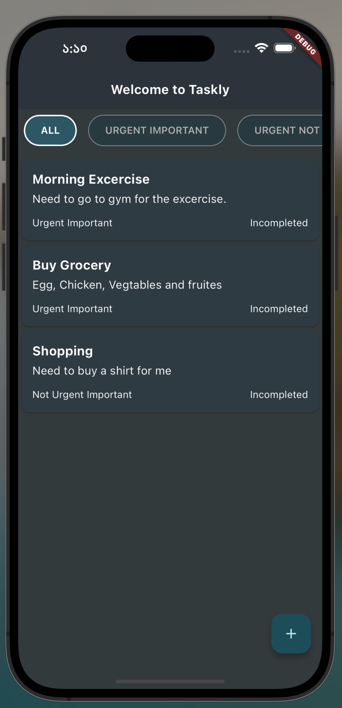
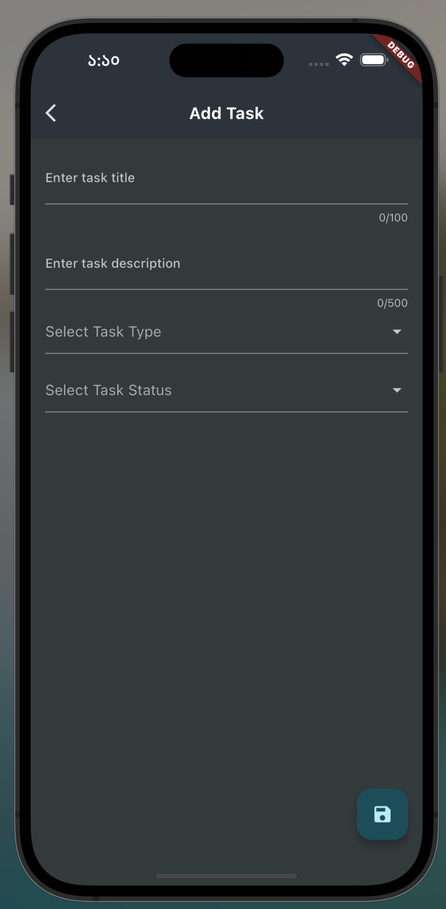

# Taskly

A simple task management app which I use daily. Before this app I was using trello to separate my task into four separate boards where each board has a specific meaning. In our daily life we have some tasks which we need to do urgently and also they are very important. May be if we miss that task it will cause a huge loss for us. Again some tasks may be urgent but they are not so important. Some taks can be done later but they are very important. Finally, we may have some tasks which not urgent and not so important. Maybe in the future we may want to complete that task. So this taskly app can help you to categorise your daily task easily so that don't need to think to much which task to do first and which task is last. 

## Features

- All tasks where you can see all available tasks.
- Add new task or edit existing task.
- Filter task by task type which mentioned above.
- Swipe task to remove.

## Tools and Architecture

- [RiverPod](https://pub.dev/packages/riverpod) for the state management
- [sqflite](https://pub.dev/packages/sqflite) for Sqlite Database
- [uuid](https://pub.dev/packages/uuid) for generating unique task id
- [Scrollable positined list](https://pub.dev/packages/scrollable_positioned_list) 

For the architecture used clean code architecture approach to architect the structure.

## Demo
Download apk from [here](https://drive.google.com/file/d/12Iprfgu9Tmpayce1zCesMeKjNqqNy8k8/view?usp=sharing)

